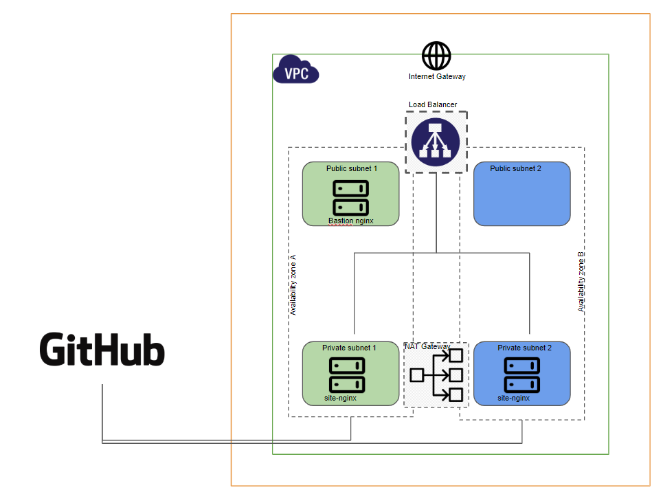

# Terraform & AWS Training 

Networking infrastructure will contain:

* VPC
* Subnets (public & private)
* Routing Tables
* NAT Gateways
* Internet Gateway
* Security Groups
* Elastic Load Balancer

Compute infrastructure will contain:

* EC2 instances (AWS)

Provisioning:

* Ansible

## Consider

**The training in this repository have been tested against AWS**

*Pros:*

* They are kept current by Amazon
* They are very cheap to spin up to do a test. 
* Free if it's an Amazon account that is less than 1 year old. 
* Please remember to TERMINATE your instance when finished.
* The t2.micro size is sufficient for these exercises and is what is used for testing.
* We recommend to use Centos7 AWS AMI. 

## Pre-requirements:

* Create an AWS account
* Ensure Terraform is installed and available on your command line; if it isn't, download it from [terraform.io](www.terraform.io) and install it. If this is your first time installing Terraform
* Create repository on www.github.com
    * The repository name must respect the following nomenclature: aws-terraform-bootcamp-name- <YYMMDD> -> The date must be the start day of the Bootcamp.
    * A branch must be generated for each assignment.
    * Generate a commit with the initial files of the original repo WITHOUT MODIFICATIONS on master-branch.
    * Only Pull Request should be generated with the MODIFIED files against the original repository
    * A Readme.md should always be included with all the information necessary to evaluate the work done [steps to test, problems found, etc.]


# To Do:
 
**Create an environment that has:**

* 1 VPC
* 2 Private Subnets
* 2 Public Subnets
* 1 Bastion Host
* 2 Webserver Hosts (Apache or NGINX)

The webserver hosts will be behind a load balancer.
The purpose of a bastion host on the public subnet is to be able to access webserver hosts
that are in the private subnets and do not have public access directly.
For this, an AWS AMI from the amazon marketplace will be used to make some modifications and build it with Hashicorp Packer that has a Local Ansible Playbook,
Once the hosts are deployed, they already have the webserver installed and working and show a website from github.

## Diagram:




## Instructions: 


## Step 1:

**Create Ansible Playbook with the necessary files to install and start a webserver and deploy a website.**

For example: You must install and start Apache, install Git and clone the website code from your repository and move it to the corresponding directory to publish it. **You can use this examples** https://www.free-css.com/free-css-templates

## Step 2:

**Create your own image with Hashicorp Packer**

[See instructions in the packer directory](https://github.com/aularmarko/pmi-bootcamp-terraform-aws/tree/master/packer)

`Packer will get a local ansible playbook and place it under "/home/centos" in the new image. So, you need the ansible.yml playbook in the same directory as packer.json file`


## Step 3:

**Create the terraform scripts** 

[See instructions in the terraform directory](https://github.com/aularmarko/pmi-bootcamp-terraform-aws/tree/master/terraform)

* The terraform tree must have:
    * vars.tf
    * terraform.tfvars
    * outputs.tf (the outputs.tf should get / show):
        * Website DNSNAME
        * Public IP of the bastion host
        * Private IPs of website hosts
    * provider.tf
    * main.tf
    * network module
    * compute module


## Step 4:

**Deploy the infra to AWS**

Execute:

`terraform init`               Initialize a Terraform working directory

then

`terraform plan`               Generate and show an execution plan


and deploy your infra:

`terraform apply`             Builds or changes infrastructure


## Git Help


**Git**
```
These are common Git commands used in various situations:

start a working area (see also: git help tutorial)
   clone      Clone a repository into a new directory
   init       Create an empty Git repository or reinitialize an existing one

work on the current change (see also: git help everyday)
   add        Add file contents to the index
   mv         Move or rename a file, a directory, or a symlink
   reset      Reset current HEAD to the specified state
   rm         Remove files from the working tree and from the index

examine the history and state (see also: git help revisions)
   bisect     Use binary search to find the commit that introduced a bug
   grep       Print lines matching a pattern
   log        Show commit logs
   show       Show various types of objects
   status     Show the working tree status

grow, mark and tweak your common history
   branch     List, create, or delete branches
   checkout   Switch branches or restore working tree files
   commit     Record changes to the repository
   diff       Show changes between commits, commit and working tree, etc
   merge      Join two or more development histories together
   rebase     Reapply commits on top of another base tip
   tag        Create, list, delete or verify a tag object signed with GPG

collaborate (see also: git help workflows)
   fetch      Download objects and refs from another repository
   pull       Fetch from and integrate with another repository or a local branch
   push       Update remote refs along with associated objects
```
