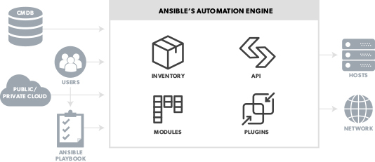

# Ansible Architecture

# About Ansible
Ansible is an IT automation tool. It can configure systems, deploy software, and orchestrate more advanced IT tasks such as continuous deployments or zero downtime rolling updates.

Ansible’s main goals are simplicity and ease-of-use. It also has a strong focus on security and reliability, featuring a minimum of moving parts, usage of OpenSSH for transport (with other transports and pull modes as alternatives), and a language that is designed around auditability by humans–even those not familiar with the program.

We believe simplicity is relevant to all sizes of environments, so we design for busy users of all types: developers, sysadmins, release engineers, IT managers, and everyone in between. Ansible is appropriate for managing all environments, from small setups with a handful of instances to enterprise environments with many thousands of instances.

Ansible manages machines in an agent-less manner. There is never a question of how to upgrade remote daemons or the problem of not being able to manage systems because daemons are uninstalled. Because OpenSSH is one of the most peer-reviewed open source components, security exposure is greatly reduced. Ansible is decentralized–it relies on your existing OS credentials to control access to remote machines. If needed, Ansible can easily connect with Kerberos, LDAP, and other centralized authentication management systems.

Design Principles
=================

*  Have a dead simple setup process and a minimal learning curve.
*  Manage machines very quickly and in parallel.
*  Avoid custom-agents and additional open ports, be agentless by
   leveraging the existing SSH daemon.
*  Describe infrastructure in a language that is both machine and human
   friendly.
*  Focus on security and easy auditability/review/rewriting of content.
*  Manage new remote machines instantly, without bootstrapping any
   software.
*  Allow module development in any dynamic language, not just Python.
*  Be usable as non-root.
*  Be the easiest IT automation system to use, ever.

# Installing Ansible

## Prerequisites

You install Ansible on a control node, which then uses SSH (by default) to communicate with your managed nodes (those end devices you want to automate).

Control node requirements
Currently Ansible can be run from any machine with Python 2 (version 2.7) or Python 3 (versions 3.5 and higher) installed. This includes Red Hat, Debian, CentOS, macOS, any of the BSDs, and so on. Windows is not supported for the control node.

When choosing a control node, bear in mind that any management system benefits from being run near the machines being managed. If you are running Ansible in a cloud, consider running it from a machine inside that cloud. In most cases this will work better than on the open Internet.

## Selecting an Ansible version to install

Which Ansible version to install is based on your particular needs. You can choose any of the following ways to install Ansible:

- Install the latest release with your OS package manager (for Red Hat Enterprise Linux (TM), CentOS, Fedora, Debian, or Ubuntu).
- Install with 'pip' (the Python package manager).
- Install from source to access the development (devel) version to develop or test the latest features.

**Installing Ansible on RHEL, CentOS, or Fedora**
On Fedora:

$ sudo dnf install ansible
On RHEL and CentOS:

$ sudo yum install ansible

