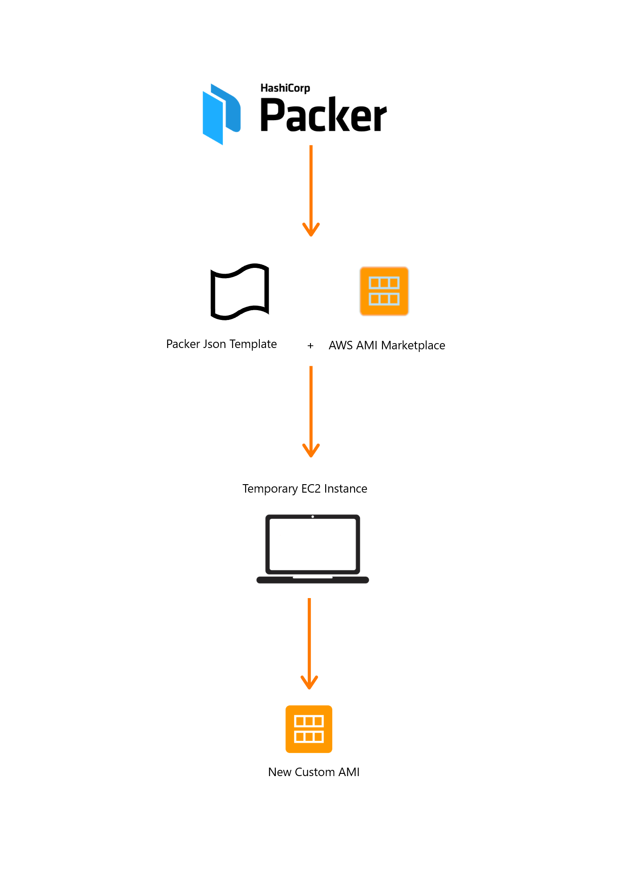

# Packer

[![Build Status][travis-badge]][travis]
[![Windows Build Status][appveyor-badge]][appveyor]
[![GoDoc][godoc-badge]][godoc]
[![GoReportCard][report-badge]][report]
[](https://codecov.io/gh/hashicorp/packer)

[travis-badge]: https://travis-ci.org/hashicorp/packer.svg?branch=master
[travis]: https://travis-ci.org/hashicorp/packer
[appveyor-badge]: https://ci.appveyor.com/api/projects/status/miavlgnp989e5obc/branch/master?svg=true
[appveyor]: https://ci.appveyor.com/project/hashicorp/packer
[godoc-badge]: https://godoc.org/github.com/hashicorp/packer?status.svg
[godoc]: https://godoc.org/github.com/hashicorp/packer
[report-badge]: https://goreportcard.com/badge/github.com/hashicorp/packer
[report]: https://goreportcard.com/report/github.com/hashicorp/packer

* Website: https://www.packer.io
* IRC: `#packer-tool` on Freenode
* Mailing list: [Google Groups](https://groups.google.com/forum/#!forum/packer-tool)

Packer is a tool for building identical machine images for multiple platforms
from a single source configuration.

Packer is lightweight, runs on every major operating system, and is highly
performant, creating machine images for multiple platforms in parallel. Packer
comes out of the box with support for many platforms, the full list of which can
be found at https://www.packer.io/docs/builders/index.html.

Support for other platforms can be added via plugins.

The images that Packer creates can easily be turned into
[Vagrant](http://www.vagrantup.com) boxes.

## Quick Start





**Note:** There is a great
[introduction and getting started guide](https://www.packer.io/intro)
for those with a bit more patience. Otherwise, the quick start below
will get you up and running quickly, at the sacrifice of not explaining some
key points.

First, [download a pre-built Packer
binary](https://www.packer.io/downloads.html) for your operating system or
[compile Packer
yourself](https://github.com/hashicorp/packer/blob/master/.github/CONTRIBUTING.md#setting-up-go-to-work-on-packer).

# Install Packer
```
wget https://releases.hashicorp.com/packer/1.5.6/packer_1.5.6_linux_amd64.zip
unzip packer_1.5.6_linux_amd64.zip
sudo mv packer /usr/local/bin/.
```

**Available commands are:**

    build       build image(s) from template
    console     creates a console for testing variable interpolation
    fix         fixes templates from old versions of packer
    inspect     see components of a template
    validate    check that a template is valid
    version     Prints the Packer version


After Packer is installed, create your first template, which tells Packer
what platforms to build images for and how you want to build them. In our
case, `Example` we'll create a simple AMI that has Redis pre-installed. Save this
file as `quick-start.json`. Export your AWS credentials as the
`AWS_ACCESS_KEY_ID` and `AWS_SECRET_ACCESS_KEY` environment variables.

### Create a Packer template

To create a Packer image for an application, you must create a Packer template. 
The template can live either within a local directory of the application or in a separate empty directory.

The configuration file determines the type of image being built and is written in JSON. For example, this file may be called my-application.json.

**Add variables:**

The contents of the file begin with cloud environment variables for your account, followed by the builders and provisioners.

NOTE: Though it is possible to create a Packer configuration file without setting up environment variables, we do not advise you do so. It is a best practice to store all important keys locally as environment variables instead of tying it to your application files.

Variables are particularly useful when it comes to sensitive information, such as your account login and SSH key fingerprint. These are the same variables used for CloudAPI and other tools. To access these variables, it's important to set the cloud environment before building your image.


```

{
    "variables": {
        "aws_access_key": "",
        "aws_secret_key": "",
        "ami_name": "ami-packer",
        "aws_region": "eu-west-1",
        "ssh_username": "ec2-user"
    },


```

**Add Packer builders**

Builders create machine images for individual platforms, using CloudAPI to create the image. 
The builder launches a temporary VM based on the template, runs any provisioning necessary, creates a reusable image, and then destroys the VM.


```
"builders": [{
        "type": "amazon-ebs",
        "access_key": "{{user `aws_access_key`}}",
        "secret_key": "{{user `aws_secret_key`}}",
        "region": "{{user `aws_region`}}",
        "instance_type": "t2.micro",
        "force_deregister": "true",
        "ssh_username": "{{user `ssh_username`}}",
        "communicator": "ssh",
        "associate_public_ip_address": true,
        "ami_name": "{{user `ami_name`}}",
        "source_ami_filter": {
            "filters": {
                "virtualization-type": "hvm",
                "name": "amzn2-ami-hvm-2.0.20200304.0-x86_64-gp2",
                "root-device-type": "ebs"
            },
            "owners": "137112412989",
            "most_recent": true
        },
        "run_tags": {
            "Name": "packer-build-image"
        }
    }],


```

**Add provisioners to customize the image**

Provisioners install and configure software within a running machine prior to the machine becoming a static image. The provisioners perform the work that customizes images to contain software including installing packages, creating users, and downloading application code.

Two of the most common provisioners are file and shell.

The file provisioner uploads files to machines built by Packer. The recommended usage of the file provisioner is to use it to upload files, and then use shell provisioner to move them to the proper place, set permissions, etc. 
The file provisioner can refer to a single file, such as index.html, or an entire directory, such as directory/.


```
"provisioners": [{
        "type": "shell",
        "inline": [
          "sudo yum install unzip -y",
          "sudo yum install git -y",
          "git clone https://github.com/aularmarko/packer_installer.git /tmp/packer/",
          "sudo sh /tmp/packer/packer-install.sh"
    ]
    }]
}

```


### Next, tell Packer to build the image:

```
$ packer build my-application.json
...
```

Packer will build an AMI according to the "quick-start" template. The AMI
will be available in your AWS account. To delete the AMI, you must manually
delete it using the [AWS console](https://console.aws.amazon.com/). Packer
builds your images, it does not manage their lifecycle. Where they go, how
they're run, etc., is up to you.

## Documentation

Comprehensive documentation is viewable on the Packer website:

https://www.packer.io/docs
