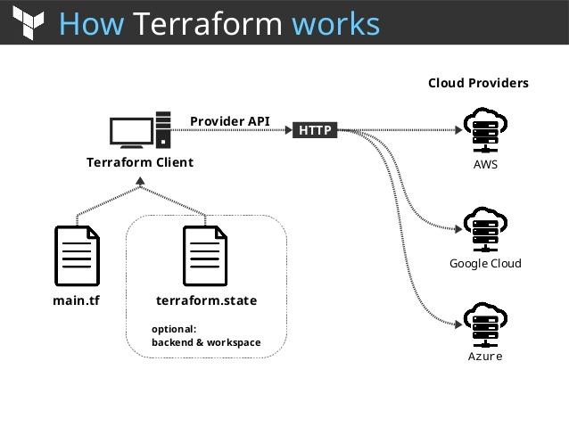

Terraform
=========

- Website: https://www.terraform.io
- Forums: [HashiCorp Discuss](https://discuss.hashicorp.com/c/terraform-core)
- Documentation: [https://www.terraform.io/docs/](https://www.terraform.io/docs/)
- Tutorials: [HashiCorp's Learn Platform](https://learn.hashicorp.com/terraform)
- Certification Exam: [HashiCorp Certified: Terraform Associate](https://www.hashicorp.com/certification/#hashicorp-certified-terraform-associate)


Terraform is a tool for building, changing, and versioning infrastructure safely and efficiently. Terraform can manage existing and popular service providers as well as custom in-house solutions.

The key features of Terraform are:

- **Infrastructure as Code**: Infrastructure is described using a high-level configuration syntax. This allows a blueprint of your datacenter to be versioned and treated as you would any other code. Additionally, infrastructure can be shared and re-used.

- **Execution Plans**: Terraform has a "planning" step where it generates an *execution plan*. The execution plan shows what Terraform will do when you call apply. This lets you avoid any surprises when Terraform manipulates infrastructure.

- **Resource Graph**: Terraform builds a graph of all your resources, and parallelizes the creation and modification of any non-dependent resources. Because of this, Terraform builds infrastructure as efficiently as possible, and operators get insight into dependencies in their infrastructure.

- **Change Automation**: Complex changesets can be applied to your infrastructure with minimal human interaction. With the previously mentioned execution plan and resource graph, you know exactly what Terraform will change and in what order, avoiding many possible human errors.

For more information, see the [introduction section](http://www.terraform.io/intro) of the Terraform website.

Getting Started & Documentation
-------------------------------
Documentation is available on the [Terraform website](http://www.terraform.io):
  - [Intro](https://www.terraform.io/intro/index.html)
  - [Docs](https://www.terraform.io/docs/index.html)

If you're new to Terraform and want to get started creating infrastructure, please check out our [Getting Started guides](https://learn.hashicorp.com/terraform#getting-started) on HashiCorp's learning platform. There are also [additional guides](https://learn.hashicorp.com/terraform#operations-and-development) to continue your learning.

Show off your Terraform knowledge by passing a certification exam. Visit the [certification page](https://www.hashicorp.com/certification/) for information about exams and find [study materials](https://learn.hashicorp.com/terraform/certification/terraform-associate) on HashiCorp's learning platform.





# Install Terraform on Linux (Centos)


`$ sudo yum update`

Next, we will install wget and unzip packages if they’re not already installed:

`$ sudo yum install wget unzip`

Now we are ready to download Terraform zip file for Linux from the official website. At the time of writing this article, the current version of Terraform was 0.11.13.

`$ wget https://releases.hashicorp.com/terraform/0.11.13/terraform_0.11.13_linux_amd64.zip`

Next, we will unpack the archive to /usr/local/bin/

`$ sudo unzip ./terraform_0.11.13_linux_amd64.zip -d /usr/local/bin/`


All done. The only thing that is left now, is to check if terraform is successfully installed, with the following command:

`$ terraform -v`

```
Common commands:
    apply              Builds or changes infrastructure
    console            Interactive console for Terraform interpolations
    destroy            Destroy Terraform-managed infrastructure
    env                Workspace management
    fmt                Rewrites config files to canonical format
    get                Download and install modules for the configuration
    graph              Create a visual graph of Terraform resources
    import             Import existing infrastructure into Terraform
    init               Initialize a Terraform working directory
    output             Read an output from a state file
    plan               Generate and show an execution plan
    providers          Prints a tree of the providers used in the configuration
    push               Upload this Terraform module to Atlas to run
    refresh            Update local state file against real resources
    show               Inspect Terraform state or plan
    taint              Manually mark a resource for recreation
    untaint            Manually unmark a resource as tainted
    validate           Validates the Terraform files
    version            Prints the Terraform version
    workspace          Workspace management

All other commands:
    debug              Debug output management (experimental)
    force-unlock       Manually unlock the terraform state
    state              Advanced state management


```


## Terraform State

Terraform must store state about your managed infrastructure and configuration. This state is used by Terraform to map real world resources to your configuration, keep track of metadata, and to improve performance for large infrastructures.

This state is stored by default in a local file named "terraform.tfstate", but it can also be stored remotely, which works better in a team environment.

Terraform uses this local state to create plans and make changes to your infrastructure. Prior to any operation, Terraform does a refresh to update the state with the real infrastructure.

For more information on why Terraform requires state and why Terraform cannot function without state, please see the page state purpose.

## Inspection and Modification
While the format of the state files are just JSON, direct file editing of the state is discouraged. Terraform provides the terraform state command to perform basic modifications of the state using the CLI.

The CLI usage and output of the state commands is structured to be friendly for Unix tools such as grep, awk, etc. Additionally, the CLI insulates users from any format changes within the state itself. The Terraform project will keep the CLI working while the state format underneath it may shift.

Finally, the CLI manages backups for you automatically. If you make a mistake modifying your state, the state CLI will always have a backup available for you that you can restore.

## Format
The state is in JSON format and Terraform will promise backwards compatibility with the state file. The JSON format makes it easy to write tools around the state if you want or to modify it by hand in the case of a Terraform bug. The "version" field on the state contents allows us to transparently move the format forward if we make modifications.


## Remote State

By default, Terraform stores state locally in a file named `terraform.tfstate`. When working with Terraform in a team, use of a local file makes Terraform usage complicated because each user must make sure they always have the latest state data before running Terraform and make sure that nobody else runs Terraform at the same time.

With remote state, Terraform writes the state data to a remote data store, which can then be shared between all members of a team. Terraform supports storing state in Terraform Cloud, HashiCorp Consul, Amazon S3, Alibaba Cloud OSS, and more.

Remote state is a feature of backends. Configuring and using remote backends is easy and you can get started with remote state quickly. If you then want to migrate back to using local state, backends make that easy as well.

## Delegation and Teamwork

Remote state gives you more than just easier version control and safer storage. It also allows you to delegate the outputs to other teams. This allows your infrastructure to be more easily broken down into components that multiple teams can access.

Put another way, remote state also allows teams to share infrastructure resources in a read-only way without relying on any additional configuration store.

For example, a core infrastructure team can handle building the core machines, networking, etc. and can expose some information to other teams to run their own infrastructure. As a more specific example with AWS: you can expose things such as VPC IDs, subnets, NAT instance IDs, etc. through remote state and have other Terraform states consume that.

For example usage, see the terraform_remote_state data source.

While remote state is a convenient, built-in mechanism for sharing data between configurations, it is also possible to use more general stores to pass settings both to other configurations and to other consumers. For example, if your environment has HashiCorp Consul then you can have one Terraform configuration that writes to Consul using consul_key_prefix and then another that consumes those values using the consul_keys data source.

## Locking and Teamwork

For fully-featured remote backends, Terraform can also use state locking to prevent concurrent runs of Terraform against the same state.

Terraform Cloud by HashiCorp is a commercial offering that supports an even stronger locking concept that can also detect attempts to create a new plan when an existing plan is already awaiting approval, by queuing Terraform operations in a central location. This allows teams to more easily coordinate and communicate about changes to infrastructure.

## Input Variables

Input variables serve as parameters for a Terraform module, allowing aspects of the module to be customized without altering the module's own source code, and allowing modules to be shared between different configurations.

When you declare variables in the root module of your configuration, you can set their values using CLI options and environment variables. When you declare them in child modules, the calling module should pass values in the module block.

## Declaring an Input Variable

Each input variable accepted by a module must be declared using a variable block:

```
variable "image_id" {
  type = string
}

variable "availability_zone_names" {
  type    = list(string)
  default = ["us-west-1a"]
}

variable "docker_ports" {
  type = list(object({
    internal = number
    external = number
    protocol = string
  }))
  default = [
    {
      internal = 8300
      external = 8300
      protocol = "tcp"
    }
  ]
}

```

The label after the variable keyword is a name for the variable, which must be unique among all variables in the same module. This name is used to assign a value to the variable from outside and to reference the variable's value from within the module.


## The name of a variable can be any valid identifier except the following:

* source
* version
* providers
* count
* for_each
* lifecycle
* depends_on
* locals

These names are reserved for meta-arguments in module configuration blocks, and cannot be declared as variable names.

The variable declaration can optionally include a type argument to specify what value types are accepted for the variable, as described in the following section.

The variable declaration can also include a default argument. If present, the variable is considered to be optional and the default value will be used if no value is set when calling the module or running Terraform. The default argument requires a literal value and cannot reference other objects in the configuration.

Using Input Variable Values
Within the module that declared a variable, its value can be accessed from within expressions as var.<NAME>, where <NAME> matches the label given in the declaration block:
```
resource "aws_instance" "example" {
  instance_type = "t2.micro"
  ami           = var.image_id
}

```
**The value assigned to a variable can be accessed only from expressions within the module where it was declared.**


# Writing a template script file for Terraform

Now, when we have learned how to successfully install Terraform software on Linux, we can create a template script file and setup infrastructure, for example, on AWS Cloud (Amazon Web Services).

Terraform uses `.tf` template files to setup desired cloud infrastructure and uses code written in a language called HCL. We will create template file called 'terraform.tf'.

`$ nano terraform.tf` 

Now we must add our credentials to terraform.tf file, setup provider name and instructions on what should terraform do. Input your AWS public and secret key so that it looks like this:
```
provider "aws" {
  region     = "us-west-2"
  access_key = "accesskey"
  secret_key = "secretkey"
}

resource "aws_instance" "example" {
  ami = "ami-8803e0f0"
  instance_type = "t2.micro"
}
```

Save the file and proceed to the Terraform initialization.

Next, we must initialize Terraform:

`$ terraform init`
```
Initializing provider plugins...
- Checking for available provider plugins on https://releases.hashicorp.com...
- Downloading plugin for provider "aws" (2.1.0)...

The following providers do not have any version constraints in configuration,
so the latest version was installed.

To prevent automatic upgrades to new major versions that may contain breaking
changes, it is recommended to add version = "..." constraints to the
corresponding provider blocks in configuration, with the constraint strings
suggested below.

* provider.aws: version = "~> 2.1"

Terraform has been successfully initialized!

You may now begin working with Terraform. Try running "terraform plan" to see
any changes that are required for your infrastructure. All Terraform commands
should now work.`
```


We are now basically ready to go. Using the terraform plan command we can simulate the process without actually creating anything on AWS:

`$ terraform plan`
```
Refreshing Terraform state in-memory prior to plan...
The refreshed state will be used to calculate this plan, but will not be
persisted to local or remote state storage.


------------------------------------------------------------------------


An execution plan has been generated and is shown below.
Resource actions are indicated with the following symbols:
 
  + create

Terraform will perform the following actions:

  + aws_instance.example
      id:                           
      ami:                          "ami-8803e0f0"
      arn:                          
      associate_public_ip_address:  
      availability_zone:            
      cpu_core_count:               
      cpu_threads_per_core:         
      ebs_block_device.#:           
      ephemeral_block_device.#:     
      get_password_data:            "false"
      host_id:                      
      instance_state:               
      instance_type:                "t2.micro"
      ipv6_address_count:           
      ipv6_addresses.#:             
      key_name:                     
      network_interface.#:          
      network_interface_id:         
      password_data:                
      placement_group:              
      primary_network_interface_id: 
      private_dns:                  
      private_ip:                   
      public_dns:                   
      public_ip:                    
      root_block_device.#:          
      security_groups.#:            
      source_dest_check:            "true"
      subnet_id:                    
      tenancy:                      
      volume_tags.%:                
      vpc_security_group_ids.#:     


Plan: 1 to add, 0 to change, 0 to destroy.

------------------------------------------------------------------------
```
`Note: You didn't specify an "-out" parameter to save this plan, so Terraform
can't guarantee that exactly these actions will be performed if
"terraform apply" is subsequently run.`


# Executing Terraform to create instance on AWS

**If we are satisfied with the current tested plan, we execute `terraform apply` to actually create our infrastructure on AWS:**

`$ terraform apply`

```
An execution plan has been generated and is shown below.
Resource actions are indicated with the following symbols:

  + create

**Terraform will perform the following actions:**

  + aws_instance.example
      id:                           
      ami:                          "ami-8803e0f0"
      arn:                          
      associate_public_ip_address:  
...

You will be asked to confirm the current action by typing “yes”:

Plan: 1 to add, 0 to change, 0 to destroy.

Do you want to perform these actions?
  Terraform will perform the actions described above.
  Only 'yes' will be accepted to approve.

  Enter a value: yes

After a few minutes the instance will be created and running:

...
  source_dest_check:            "" => "true"
  subnet_id:                    "" => ""
  tenancy:                      "" => ""
  volume_tags.%:                "" => ""
  vpc_security_group_ids.#:     "" => ""
aws_instance.example: Still creating... (10s elapsed)
aws_instance.example: Still creating... (20s elapsed)
aws_instance.example: Still creating... (30s elapsed)
aws_instance.example: Still creating... (40s elapsed)
aws_instance.example: Creation complete after 43s (ID: i-07977d913a7264459)

Apply complete! Resources: 1 added, 0 changed, 0 destroyed.
```


# As you can see when you open AWS console there’s our instance up and running:


`Note that Terraform remembers the state of your infrastructure, so that if you change the plan and apply again it will update your existing cloud infrastructure.`

The last thing we are left to do, is to see how we can terminate and remove our plan. It is a very simple action with `terraform destroy` command (you will be asked again to confirm your action):

```

$ terraform destroy
aws_instance.example: Refreshing state... (ID: i-07977d913a7264459)

An execution plan has been generated and is shown below.
Resource actions are indicated with the following symbols:
  - destroy

Terraform will perform the following actions:

  - aws_instance.example


Plan: 0 to add, 0 to change, 1 to destroy.

Do you really want to destroy all resources?
  Terraform will destroy all your managed infrastructure, as shown above.
  There is no undo. Only 'yes' will be accepted to confirm.

  Enter a value: yes

aws_instance.example: Destroying... (ID: i-07977d913a7264459)
aws_instance.example: Still destroying... (ID: i-07977d913a7264459, 10s elapsed)
aws_instance.example: Still destroying... (ID: i-07977d913a7264459, 20s elapsed)
aws_instance.example: Still destroying... (ID: i-07977d913a7264459, 30s elapsed)
aws_instance.example: Still destroying... (ID: i-07977d913a7264459, 40s elapsed)
aws_instance.example: Still destroying... (ID: i-07977d913a7264459, 50s elapsed)
aws_instance.example: Still destroying... (ID: i-07977d913a7264459, 1m0s elapsed)
aws_instance.example: Destruction complete after 1m6s

Destroy complete! Resources: 1 destroyed.

```
