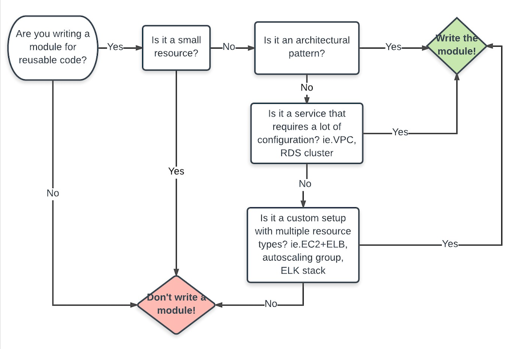

# What are modules for?

## Here are some of the ways that modules help solve the problems listed above:

- Organize configuration - Modules make it easier to navigate, understand, and update your configuration by keeping related parts of your configuration together. Even moderately complex infrastructure can require hundreds or thousands of lines of configuration to implement. By using modules, you can organize your configuration into logical components.

- Encapsulate configuration - Another benefit of using modules is to encapsulate configuration into distinct logical components. Encapsulation can help prevent unintended consequences, such as a change to one part of your configuration accidentally causing changes to other infrastructure, and reduce the chances of simple errors like using the same name for two different resources.

- Re-use configuration - Writing all of your configuration from scratch can be time consuming and error prone. Using modules can save time and reduce costly errors by re-using configuration written either by yourself, other members of your team, or other Terraform practitioners who have published modules for you to use. You can also share modules that you have written with your team or the general public, giving them the benefit of your hard work.

- Provide consistency and ensure best practices - Modules also help to provide consistency in your configurations. Not only does consistency make complex configurations easier to understand, it also helps to ensure that best practices are applied across all of your configuration. For instance, cloud providers give many options for configuring object storage services, such as Amazon S3 or Google Cloud Storage buckets. There have been many high-profile security incidents involving incorrectly secured object storage, and given the number of complex configuration options involved, it's easy to accidentally misconfigure these services.

- Using modules can help reduce these errors. For example, you might create a module to describe how all of your organization's public website buckets will be configured, and another module for private buckets used for logging applications. Also, if a configuration for a type of resource needs to be updated, using modules allows you to make that update in a single place and have it be applied to all cases where you use that module.




# What is a Terraform module?

A Terraform module is a set of Terraform configuration files in a single directory. Even a simple configuration consisting of a single directory with one or more .tf files is a module. When you run Terraform commands directly from such a directory, it is considered the root module. So in this sense, every Terraform configuration is part of a module. You may have a simple set of Terraform configuration files such as:
```
$ tree minimal-module/
.
├── LICENSE
├── README.md
├── main.tf
├── variables.tf
├── outputs.tf
In this case, when you run terraform commands from within the minimal-module directory, the contents of that directory are considered the root module.
```


# Calling modules
Terraform commands will only directly use the configuration files in one directory, which is usually the current working directory. However, your configuration can use module blocks to call modules in other directories. When Terraform encounters a module block, it loads and processes that module's configuration files.

A module that is called by another configuration is sometimes referred to as a "child module" of that configuration.


# Local and remote modules

Modules can either be loaded from the local filesystem, or a remote source. Terraform supports a variety of remote sources, including the Terraform Registry, most version control systems, HTTP URLs, and Terraform Cloud or Terraform Enterprise private module registries.

# Module best practices

In many ways, Terraform modules are similar to the concepts of libraries, packages, or modules found in most programming languages, and provide many of the same benefits. Just like almost any non-trivial computer program, real-world Terraform configurations should almost always use modules to provide the benefits mentioned above.

- We recommend that every Terraform practitioner use modules by following these best practices:

- Start writing your configuration with modules in mind. Even for modestly complex Terraform configurations managed by a single person, you'll find the benefits of using modules outweigh the time it takes to use them properly.

- Use local modules to organize and encapsulate your code. Even if you aren't using or publishing remote modules, organizing your configuration in terms of modules from the beginning will significantlty reduce the burden of maintaining and updating your configuration as your infrastructure grows in complexity.

- Use the public Terraform Registry to find useful modules. This way you can more quickly and confidently implement your configuration by relying on the work of others to implement common infrastructure scenarios.

- Publish and share modules with your team. Most infrastructure is managed by a team of people, and modules are important way that teams can work together to create and maintain infrastructure. As mentioned earlier, you can publish modules either publicly or privately. We will see how to do this in a future guide in this series.

# Modules Sources

The source argument in a module block tells Terraform where to find the source code for the desired child module.

Terraform uses this during the module installation step of terraform init to download the source code to a directory on local disk so that it can be used by other Terraform commands.

The module installer supports installation from a number of different source types, as listed below.

- Local paths

- Terraform Registry

- GitHub

- Bitbucket

- Generic Git, Mercurial repositories

- HTTP URLs

- S3 buckets

- GCS buckets


# Local Paths

Local path references allow for factoring out portions of a configuration within a single source repository.

```
module "vpc" {
  source = "./vpc"
}
```
A local path must begin with either ./ or ../ to indicate that a local path is intended, to distinguish from a module registry address.

Local paths are special in that they are not "installed" in the same sense that other sources are: the files are already present on local disk (possibly as a result of installing a parent module) and so can just be used directly. Their source code is automatically updated if the parent module is upgraded. 


# GitHub

Terraform will recognize unprefixed github.com URLs and interpret them automatically as Git repository sources.

```
module "vpc" {
  source = "github.com/bootcamp/vpc"
}

```

