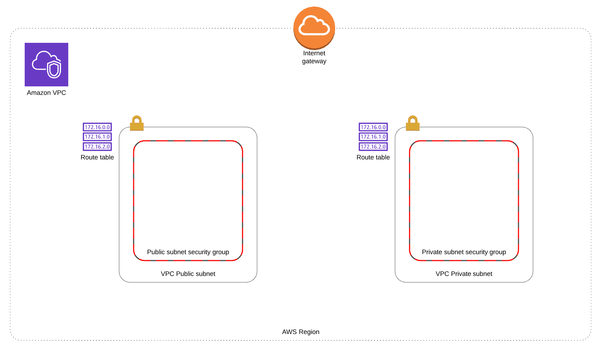

# Amazon VPC (Virtual Private Cloud) 
    It is the option to create private virtual networks in an isolated section of Amazon Web Services.
   

# Amazon VPC elements: 

    A virtual cloud network created in Amazon VPC has the distinction of being isolated from the rest of the virtual networks in AWS.
    AWS resources can be used within the Amazon VPC network and create Amazon EC2 instances there.

- ## Subnet:
    It is the way that Amazon VPC has to create partitions of the same private network. This subnet acts as a network by itself, with its own routing table for traffic management of instances within the subnet itself.

- ## Routing table:
    They are used to redirect traffic within the network correctly. The same routing table can have multiple associated subnets but a subnet can only have one associated routing table at the same time.

- ## IP Range:
    The private IP addresses that Amazon VPC provides are not accessible from the Internet, but can be used to establish communications between instances within the same private network. Public IP addresses need to first contact a gateway so that they can be accessed from computers connected to the Internet.

# Examples:

- IP CIDR block
    Ejemplo: 10.0.0.0/16

- VPC name
    Ejemplo: VPC_1

- Public subnet 
    Ejemplo: 10.0.0.0/24

- Availability Zone
    us-east-1 
    us-east-2
    
- Subnet name
   Ejemplo: Subnet_1

- Enable DNS hostnames 
    Habilitar/Deshabilitar