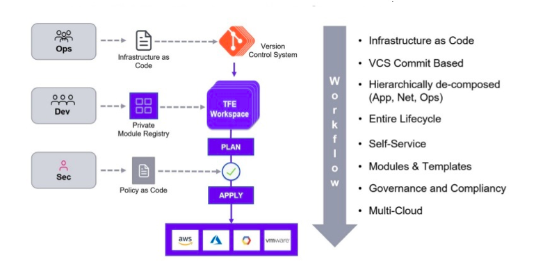
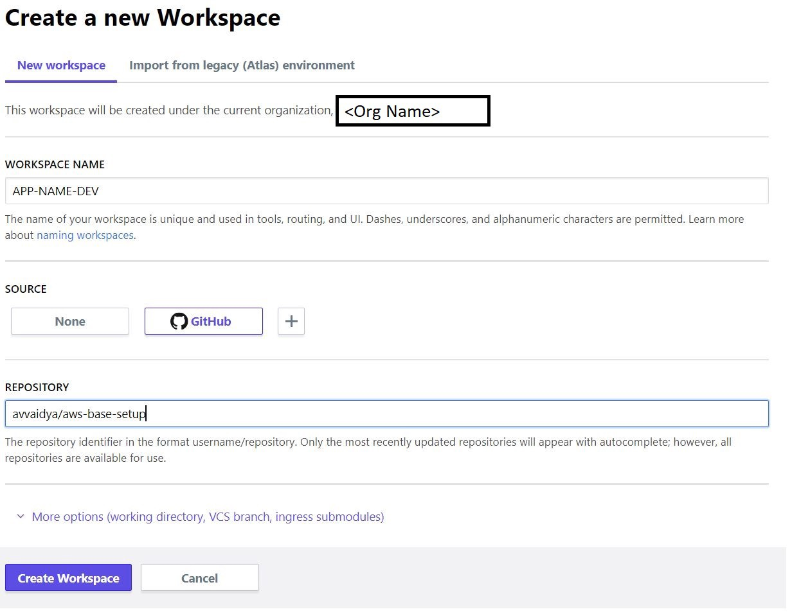
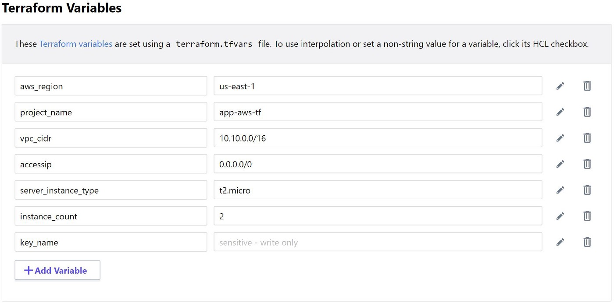
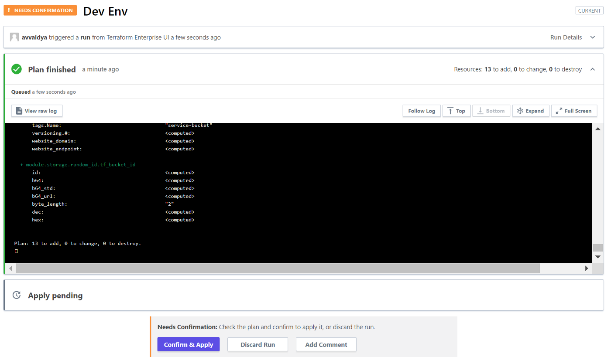
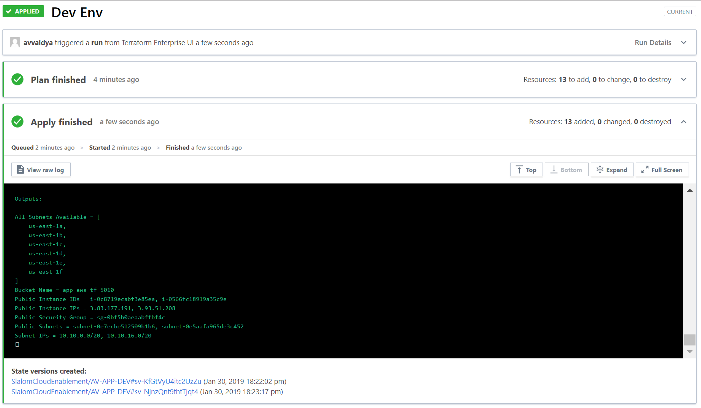

# Terraform Enterprise

Terraform Enterprise is the self-hosted distribution of Terraform Cloud. It offers enterprises a private instance of the Terraform Cloud application, with no resource limits and with additional enterprise-grade architectural features like audit logging and SAML single sign-on.

Terraform Cloud is an application that helps teams use Terraform together. It manages Terraform runs in a consistent and reliable environment, and includes easy access to shared state and secret data, access controls for approving changes to infrastructure, a private registry for sharing Terraform modules, detailed policy controls for governing the contents of Terraform configurations, and more.

For independent teams and small to medium-sized businesses, Terraform Cloud is also available as a hosted service at https://app.terraform.io.

## Terraform WorkFlow

**Workspaces:** Infrastructure is organized using Workspaces in TFE. Workspace consists of Terraform configuration, variables, run history and Terraform state information.

**Terraform Statefile Management:** This may not sound a big deal but I have seen 100s of state files created. Managing a large volume of state files can get tricky. TFE takes care of managing state files.

**Private Module Registry:** A central service registry to publish Terraform modules. Modules work as building blocks of complex infrastructures.

**Sentinel  Integrated policy-as-a-code framework:**  You can implement policies that are enforced at the Terraform plan level. For example — admins can easily set up a policy that would stop developers from spinning up large instances in AWS. This violation is caught as soon as developers check-in Terraform files. This is one example of many, powerful, policy-based protections we can put in place.

# Using Terraform Enterprise — Create Infrastructure

## Create a Organization:

Organizations are a shared space for teams to collaborate on workspaces in Terraform Cloud.

Users can create new organizations by clicking the "Create new organization" button in the organization switcher menu. The new organization page also displays automatically when the currently logged-in user does not belong to any organizations, as when first logging in as a new user.

To create a new organization, provide a unique name and a primary contact email address. Organization names can include numbers, letters, underscores (_), and hyphens (-).

Once you have created an organization, you can invite other users from your organization settings.

## Organization settings:

You can view and manage an organization's settings by clicking the "Settings" link in the top navigation bar.

Only organization owners can manage an organization's settings. However, other users can use this section to view the organization's contact email, view the membership of any teams they belong to, and view the organization's authentication policy.

**General**
The general settings page is shown to all users in an organization, and displays the organization's name and contact email.

Organization owners can use this page to update the organization's contact email or delete the organization.

**Plan & Billing**
The plan and billing page allows organization owners to upgrade to one of Terraform Cloud's paid plans, downgrade to a free plan, or begin a free trial of paid features. It also displays any invoices for previous plan payments.

**Users**
The users page allows organization owners to invite new Terraform Cloud users into the organization, cancel invitations, and remove existing members.

The list of users is split into two tabs: one for currently active users, and one for invited users who haven't accepted their invitations yet. If the lists are large, you can filter them by username or email using the search field at the top. For active users, the list includes usernames, email addresses, avatar icons, two-factor authentication status, and current team memberships.

## Create A Workspace :

It is recommended to create a workspace per application per environment. E.g. For a given app, there can be workspaces for Dev, Test and Prod environment.

## Workspace Naming

Terraform Cloud organizes workspaces by name, so it's important to use a consistent and informative naming strategy. And although future releases of Terraform Cloud will add more organizational tools, the name will always be the most important piece of information about a workspace.

Workspace names need to be 90 characters or less and can only include letters, numbers, -, and _.

The best way to make names that are both unique and useful is to combine the workspace's most distinguishing attributes in a consistent order. Attributes can be any defining characteristic of a workspace — such as the component being managed, the environment it runs in, and the region it is provisioned into.

A good strategy to start with is <COMPONENT>-<ENVIRONMENT>-<REGION>. For example:

- networking-prod-us-east
- networking-staging-us-east
- networking-prod-eu-central
- networking-staging-eu-central
- monitoring-prod-us-east
- monitoring-staging-us-east
- monitoring-prod-us-eu-central
- monitoring-staging-eu-central

## Providing Configuration Versions

There are two ways to provide configuration versions for a workspace:

With a connected VCS repository. Terraform Cloud can automatically fetch content from supported VCS providers, and uses webhooks to get notified of code changes. This is the most convenient way to use Terraform Cloud. See The UI- and VCS-driven Run Workflow for more information.

A VCS connection can be configured when a workspace is created, or later in its version control settings.

Note: When a workspace is connected to a VCS repository, directly uploaded configuration versions can only be used for speculative plans. This helps ensure your VCS remains the source of truth for all real infrastructure changes.

With direct uploads. You can use a variety of tools to directly upload configuration content to Terraform Cloud:

**Terraform CLI:** With the remote backend configured, the terraform plan and terraform apply commands will perform remote runs by uploading a configuration from a local working directory. See The CLI-driven Run Workflow for more information.

**API:* Terraform Cloud's API can accept configurations as .tar.gz files, which can be uploaded by a CI system or other workflow tools. See The API-driven Run Workflow for more information.
When configuration versions are provided via the CLI or API, Terraform Cloud can't automatically react to code changes in the underlying VCS repository.

# Code Organization and Repository Structure

## Organizing Separate Configurations
Most organizations either keep each Terraform configuration in a separate repository, or keep many Terraform configurations as separate directories in a single repository (often called a "monorepo").

**Terraform Cloud works well with either approach, but monorepos require some extra configuration:**

Each workspace must specify a Terraform working directory, so Terraform Cloud knows which configuration to use.
If the repository includes any shared Terraform modules, you must add those directories to the automatic run triggering setting for any workspace that uses those modules.
Note: If your organization does not have a strong preference, we recommend using separate repositories for each configuration and using the private module registry to share modules. This allows for faster module development, since you don't have to update every configuration that consumes a module at the same time as the module itself.

## Organizing Multiple Environments for a Configuration

**There are also a variety of ways to handle multiple environments. The most common approaches are:**

- All environments use the same main branch, and environment differences are handled with Terraform variables. To protect production      environments, wait to apply runs until their changes are verified in staging.

- Different environments use different long-lived VCS branches. To protect production environments, merge changes to the production branch after they have been verified in staging.

- Different environments use completely separate configurations, and shared behaviors are handled with shared Terraform modules. To protect production environments, verify new module versions in staging before updating the version used in production.

- Terraform Cloud works well with all of these approaches. If you used long-lived branches, be sure to specify which branch to use in each workspace's VCS connection settings.

## How Terraform Cloud Uses VCS Access
Most workspaces in Terraform Cloud are associated with a VCS repository, which provides Terraform configurations for that workspace. To find out which repos are available, access their contents, and create webhooks, Terraform Cloud needs access to your VCS provider.

Although Terraform Cloud's API lets you create workspaces and push configurations to them without a VCS connection, the primary workflow expects every workspace to be backed by a repository.

**To use configurations from VCS, Terraform Cloud needs to do several things:**

- Access a list of repositories, to let you search for repos when creating new workspaces.
- Register webhooks with your VCS provider, to get notified of new commits to a chosen branch.
- Download the contents of a repository at a specific commit in order to run Terraform with that code.

## Webhooks
**Terraform Cloud uses webhooks to monitor new commits and pull requests.**

- When someone adds new commits to a branch, any Terraform Cloud workspaces based on that branch will begin a Terraform run. Usually a user must inspect the plan output and approve an apply, but you can also enable automatic applies on a per-workspace basis. You can prevent automatic runs by locking a workspace.

- When someone submits a pull request/merge request to a branch, any Terraform Cloud workspaces based on that branch will perform a speculative plan with the contents of the request and links to the results on the PR's page. This helps you avoid merging PRs that cause plan failures.

## Setup Variables (Terraform & Environment Variables):

Setup Terraform variables and environment variables. In Environment Variable image below, note the checkbox to indicate that variable has sensitive information. If this checkbox is selected, data is encrypted and can not be read or updated. This allows admins to store secrets/keys in a secure way.

# Queue Plan (Run the Terraform configuration):

First, it runs a Terraform plan and then waits for confirmation to run Terraform apply.

